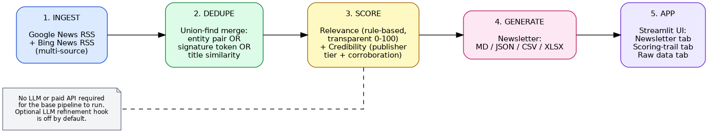

# FMCG Deal Intelligence Newsletter

A pipeline that turns public FMCG news into a short, structured newsletter of
recent M&A, investment, and divestiture activity — with every de-duplication
and scoring decision left visible and explainable, not hidden inside a model
call.




Try the application here: [Open FMCG Deal Intelligence App](https://fmcg-deal-intelligence-5ojbb2gw55xzca2ary5ljt.streamlit.app/)

## What it does

```
ingest  →  dedupe  →  score (relevance + credibility)  →  generate  →  Streamlit app
```

1. **Ingest** — pulls FMCG deal news from multiple RSS sources (Google News,
   Bing News), not just one feed.
2. **Dedupe** — merges articles covering the same deal even when outlets use
   completely different wording, using three complementary signals combined
   with a union-find merge (see `pipeline/dedupe.py`).
3. **Score** — every article gets a transparent 0-100 **relevance** score and
   a 0-100 **credibility** score, each with a plain-English list of reasons.
   No LLM call is required for the base pipeline to run.
4. **Generate** — assembles the surviving deals into a newsletter in four
   formats: Markdown (for skimming), Excel (the requested newsletter
   deliverable), JSON, and CSV (the requested raw data deliverable).
5. **App** — a Streamlit UI with a Newsletter tab, a Scoring-trail tab (why
   each item was included/excluded/merged), and a Raw data tab.

## Quickstart

```bash
git clone <this-repo-url>
cd fmcg-newsletter
python -m venv .venv && source .venv/bin/activate    # .venv\Scripts\activate on Windows
pip install -r requirements.txt
streamlit run app.py
```

The app opens in **Demo mode** by default — it runs the full pipeline on a
small set of real, recently reported FMCG deals gathered by hand (see
`data/demo_seed.json`), so you can review every stage's logic with zero
network calls and zero API keys. Switch to **Live fetch** in the sidebar to
pull current results from RSS (needs outbound internet, which Streamlit
Cloud / Vercel have).

Run the pipeline directly without the UI:

```bash
python -m pipeline.runner
# writes output/newsletter.md, newsletter.json, newsletter.xlsx, raw_data.csv
```

## Configuration

Copy `.env.example` to `.env`. **Nothing is required** for the demo to run —
the base pipeline is entirely rule-based. The only optional variables enable
an LLM refinement hook (off by default) for borderline relevance scores.

## Pipeline logic, briefly

**De-duplication** (`pipeline/dedupe.py`) merges two articles if *any* of
three signals fire:
- they extract to the same acquirer/target pair,
- they share a distinctive proper-noun "signature" token (e.g. both
  headlines mention "Saltair" even if every other word differs), or
- their raw titles are highly similar (catches verbatim syndication).

Three signals instead of one because each fails differently: entity
extraction breaks when outlets paraphrase around different nouns; plain word
overlap between titles is often low even for the same story. The signature-
token check is what actually catches most real-world duplicates here.

**Relevance scoring** (`pipeline/scoring.py`) adds points for deal-type
language (acquire/invest/divest/JV), FMCG category terms, a stated deal
value, and a named acquirer/target — then subtracts points for off-topic
terms with no FMCG context. Every point is logged in `relevance_reasons`.

**Credibility scoring** starts from a publisher tier (wire services and
major business press > trade press > aggregators/blogs/unverified), then
adds a bonus for each independent source that reported the same deal
(`corroboration_count`, produced for free by the dedupe stage). A
single-source, low-tier, uncorroborated item — e.g. an anonymous blog rumor —
is excluded even if its text otherwise reads like a deal, which is the
"sensible credibility" behavior a business user would expect.

**Known limitations** — the entity extractor is regex-based, not a real NER
model, so acquirer/target extraction is sometimes wrong or incomplete on
unusual phrasing (visible in the raw data — e.g. "BHJ → Australia" instead
of "BHJ → Staughton Group"). RSS snippets are short, so relevance scoring
occasionally misses corporate-speak divestiture language that a full
article body would catch (see `Nestlé water business` in the demo output,
excluded below threshold). Both are reasonable places to spend the next
iteration: swap the regex extractor for a small NER model, or fetch full
article text before scoring.

## Project structure

```
fmcg-newsletter/
├── app.py                   Streamlit front end
├── pipeline/
│   ├── models.py            shared Article record
│   ├── ingest.py            multi-source RSS + demo-mode loader
│   ├── dedupe.py            union-find de-duplication
│   ├── scoring.py           relevance + credibility scoring
│   ├── newsletter.py        Markdown / JSON / CSV assembly
│   ├── build_excel.py       styled .xlsx newsletter
│   └── runner.py            pipeline orchestration
├── data/
│   └── demo_seed.json       real FMCG deals used for the offline demo
├── output/                  generated files (newsletter.md/.json/.xlsx, raw_data.csv)
├── assets/architecture.png
├── requirements.txt
└── .env.example
```

## Tech stack

Python, Streamlit, `feedparser`, `openpyxl`, `pandas`. No ML/LLM dependency
required to run.

## Deploying

**Streamlit Community Cloud**: push this repo, point Streamlit Cloud at
`app.py`, done — no secrets required for demo mode.

**Vercel**: wrap `pipeline/runner.py` in a small FastAPI/Flask app and deploy
as a Python serverless function, or use `streamlit-vercel` style adapters;
the pipeline code itself has no Streamlit-specific dependency, so it's
portable to any front end.

## Deliverables checklist (per assignment)

- [x] Demo app link — *add your deployed Streamlit/Vercel URL here*
- [x] GitHub link — *this repo*
- [x] Raw data in CSV/JSON — `output/raw_data.csv`, `output/newsletter.json`
- [x] Pipeline explanation with de-dup and relevance logic — this README +
      inline comments in `pipeline/dedupe.py` and `pipeline/scoring.py`
- [x] Structured newsletter in Excel — `output/newsletter.xlsx`
